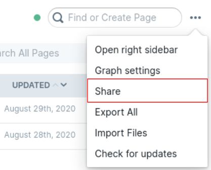
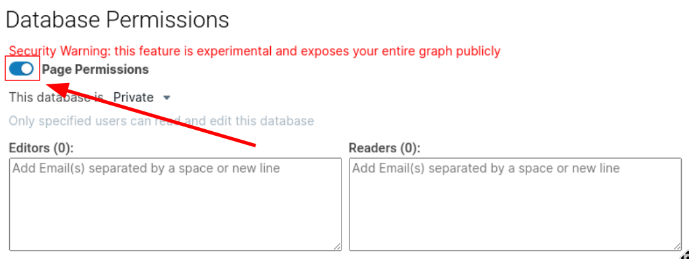

import RoamTester from 'components/RoamTester';

Roam Research has a feature called "Page Permissions".
This is an experimental feature which allows you to share certain pages of your graph with the outside world.

However, this feature has a side-effect which exposes your graph publicly to anyone who is tech savvy.

Using the following tool you can test your graph's privacy. It's completely secure - it doesn't send any of your data to any server, the data is only ever in your browser.

## Test my graph's privacy

<RoamTester />

### How do I disable the feature?

First, open the "Share" menu in the top right hand corner of Roam.

Next disable the toggle next to the text "Page Permissions".

Voila! Your graph is now private.

### I want to keep page sharing enabled, what should I do?

Enabling the sharing feature at all is very dangerous.
Anyone who wants to "hack" your graph needs to know it's name.
By sharing your graph, you expose the database name in the URL.

If you really feel like you want to share your Roam graph, only share it with people you trust, and make sure your Roam database name is impossible to guess.
